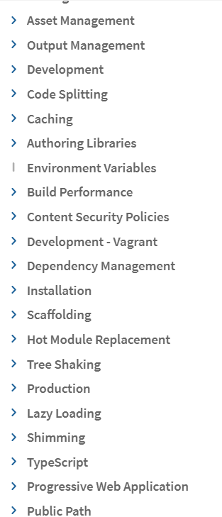

<table>
    <thead>
        <tr>
            <th colspan="5" style="text-align: center;"><strong>Subjects of Study</strong></th>
        </tr>
        <tr>
            <td colspan="5">The links below are to the parent GitHub repos of completed courses, resources, my own notes, links to articles, etc. about the topics shown below. They are designed to be my "go-to" place for teaching myself the given subject.</td>
        </tr>
    </thead>
    <tbody>
        <tr>
            <td><a href="https://github.com/coolinmc6/analytics">Analytics</a></td>
            <td><a href="https://github.com/coolinmc6/CS-concepts">Computer Science</a></td>
            <td><a href="https://github.com/coolinmc6/design-ux-ui#product-design--development">Product Development</a></td>
            <td><a href="https://github.com/coolinmc6/design-ux-ui">UX / UI Design</a></td>
            <td><strong><a href="https://github.com/coolinmc6/front-end-dev">Front End Development</a></strong></td>
        </tr>
        <tr>
            <td></td>
            <td></td>
            <td></td>
            <td></td>
            <td><a href="https://github.com/coolinmc6/front-end-dev/blob/master/webpack.md">Webpack</a></td>
        </tr>
    </tbody>
</table>

# Webpack Practice #001

- The *Getting Started* project runs you through the basics of why a dependency 
manager / bundler like Webpack is useful. 
- In the initial example, we want to use
lodash, so we include it in our `<head>` as a script. But there are several problems:
  - it's not immediately apparent that your script actually needs lodash
  - if a dependency is missing or in the wrong order, your app won't work
  - if a dependency isn't used, the browser downloads unnecessary code
- Restated:
  - do we need it?
  - did we include in right order?
  - did we actually use it?
- So instead, we create a bundle. We do that by:
  - including lodash into `index.js`
  - update our `index.html` to use the generated `main.js` file instead
  - we create our `dist` folder to hold everything
- When we run `npx webpack`, the `main.js` file has everything we need and
has included the appropriate dependencies
  - Webpack also **transpiles** the code so that older browsers can use it
- For more complex setups, we also need to use a configuration file, 
`webpack.config.js`

```js
const path = require('path');

module.exports = {
  entry: './src/index.js',
  output: {
    filename: 'main.js',
    path: path.resolve(__dirname, 'dist'),
  },
};
```
- to simplify the build process, we add a script to our `package.json` so that
"build" does `webpack`

**COMPLETE**

- I already knew a lot of that. Where I struggle is being able to spin-up a
new webpack project quickly. It's not always immediately obvious to me how
to setup the dev server, how to add modules, or how to add babel and get it
to work with react. I've done it in my [webpack-starter](https://github.com/coolinmc6/webpack-starter) but it feels pretty weak...it must be updated.
- There are a number of other tutorials / sections that I'd need to learn:

